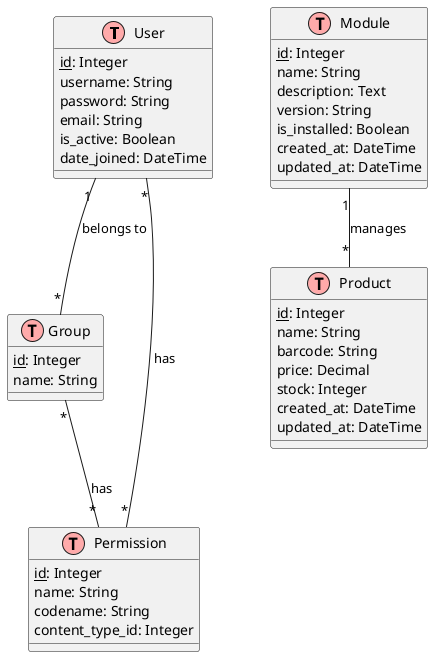

# Entity Relationship Diagram (ERD)

## Entity Descriptions

### User
- Represents system users
- Can belong to multiple groups
- Has specific permissions based on group membership

### Group
- Represents user roles (manager, user, public)
- Has specific permissions assigned
- Users can belong to multiple groups

### Module
- Represents installable modules
- Tracks installation status
- Manages version information
- Controls access to module features

### Product
- Represents product data
- Managed by the product module
- Contains product details (name, barcode, price, stock)

### Permission
- Represents system permissions
- Assigned to groups
- Controls access to specific actions

## Relationships

1. User-Group: Many-to-Many
   - Users can belong to multiple groups
   - Groups can have multiple users

2. Group-Permission: Many-to-Many
   - Groups can have multiple permissions
   - Permissions can be assigned to multiple groups

3. Module-Product: One-to-Many
   - A module can manage multiple products
   - Products belong to a specific module

4. User-Permission: Many-to-Many
   - Users can have multiple permissions
   - Permissions can be assigned to multiple users 