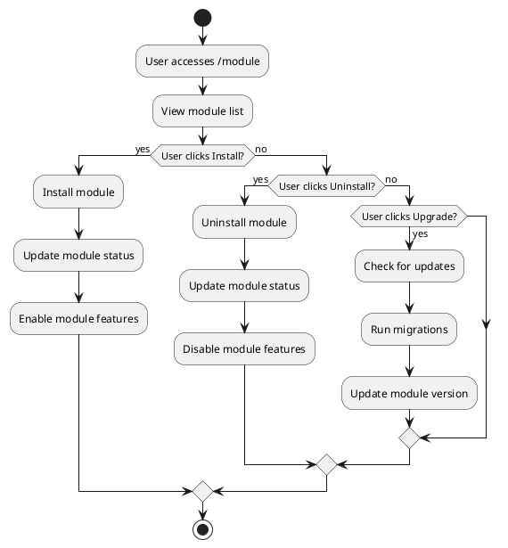
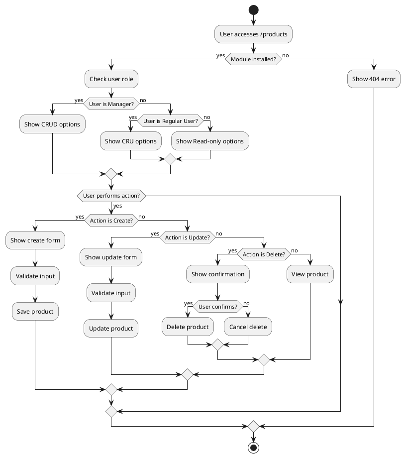
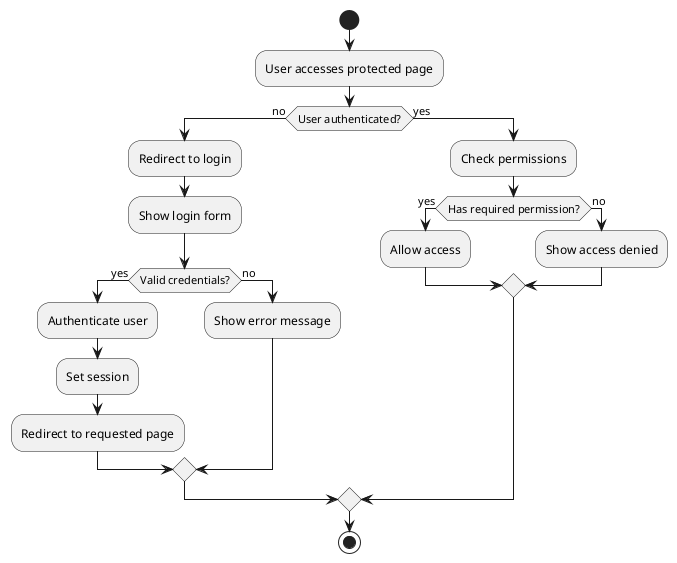

# System Flowchart

## Module Management Flow

## Product Management Flow

## Authentication Flow

## Process Descriptions

### Module Management
1. User accesses module management page
2. Views list of available modules
3. Can perform actions:
   - Install: Enables module features
   - Uninstall: Disables module features
   - Upgrade: Updates module and runs migrations

### Product Management
1. User accesses product management page
2. System checks:
   - Module installation status
   - User role and permissions
3. Based on role:
   - Manager: Full CRUD access
   - Regular User: Create, Read, Update access
   - Public: Read-only access
4. Actions require confirmation for delete operations

### Authentication
1. User attempts to access protected page
2. System checks authentication status
3. If not authenticated:
   - Redirects to login
   - Validates credentials
   - Sets session on success
4. If authenticated:
   - Checks required permissions
   - Allows or denies access accordingly 