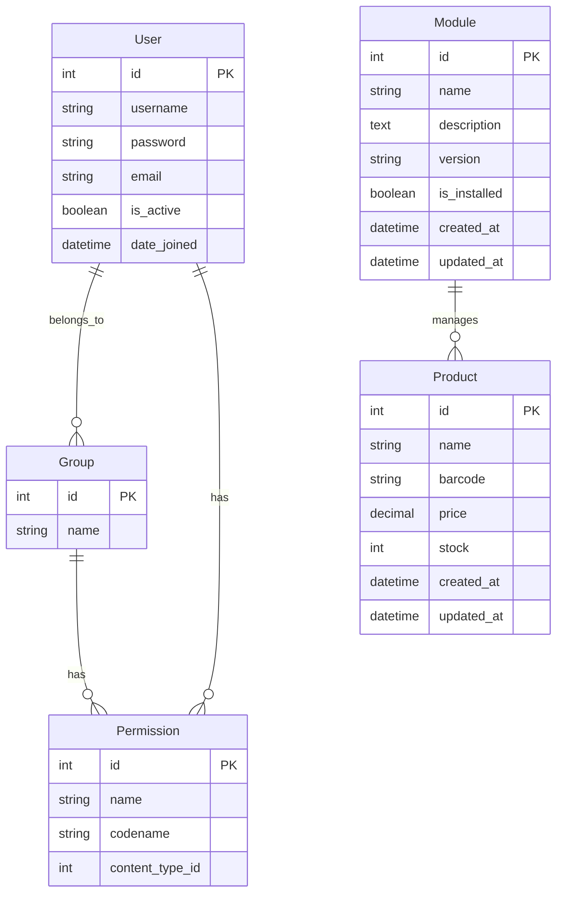
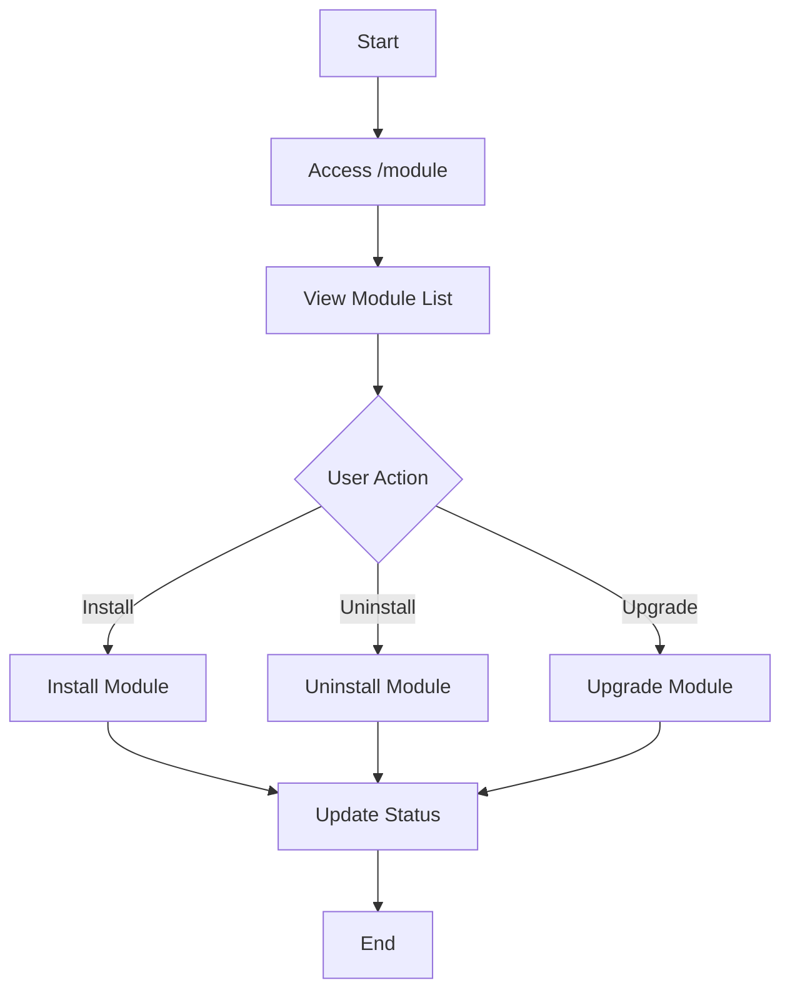
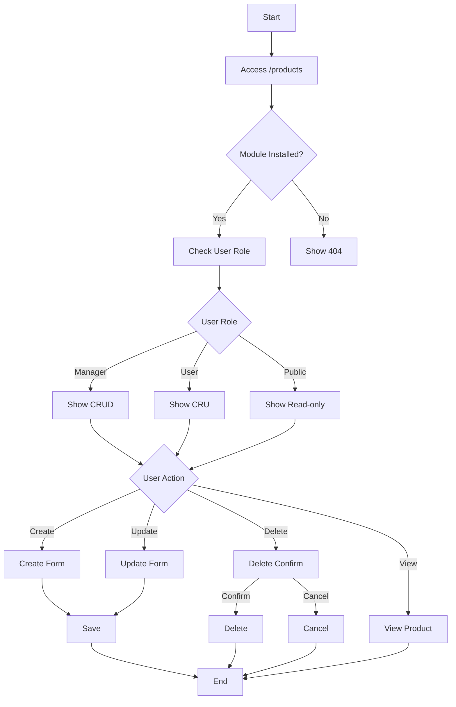
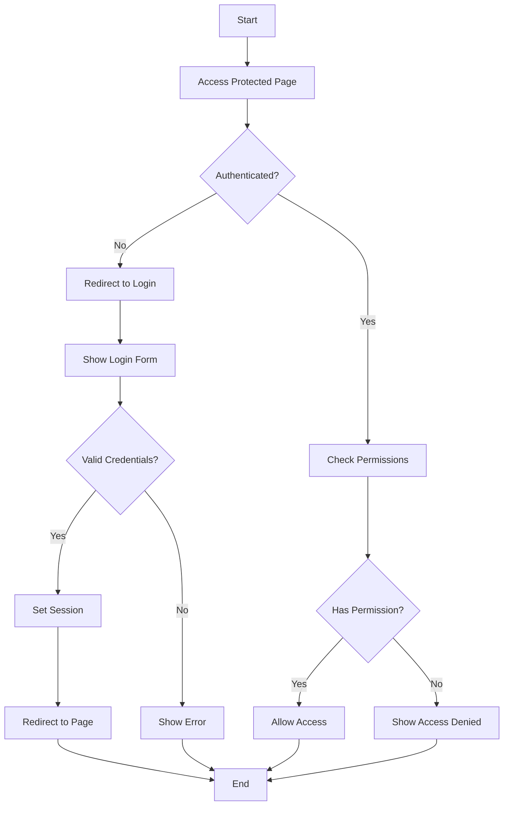

# System Design Documentation

## Database Schema (ERD)



## Module Management Flow



## Product Management Flow



## Authentication Flow



## UI Design

### Module List Page
```
+----------------------------------+
|  Modular Django        [Login]   |
+----------------------------------+
| Modules | Products              |
+----------------------------------+
| Available Modules                |
+----------------------------------+
| Name    | Desc  | Ver  | Status |
|---------|-------|------|--------|
| Product | CRUD  | 1.0  | [Inst] |
| Module  |       |      |        |
+----------------------------------+
```

### Product List Page
```
+----------------------------------+
|  Modular Django        [Logout]  |
+----------------------------------+
| Modules | Products              |
+----------------------------------+
| Products                [Add]    |
+----------------------------------+
| Name  | Barcode | Price | Stock |
|-------|---------|-------|-------|
| Item1 | 123456  | $10   | 100   |
| Item2 | 789012  | $20   | 50    |
+----------------------------------+
```

### Product Form
```
+----------------------------------+
|  Create/Update Product           |
+----------------------------------+
| Name:     [                  ]   |
| Barcode:  [                  ]   |
| Price:    [                  ]   |
| Stock:    [                  ]   |
|                                  |
| [Save] [Cancel]                  |
+----------------------------------+
```

### Delete Confirmation
```
+----------------------------------+
|  Delete Product                  |
+----------------------------------+
| Are you sure to delete this      |
| data?                            |
|                                  |
| [Yes, Delete] [Cancel]           |
+----------------------------------+
```

## Color Scheme
- Primary: #007bff (Bootstrap Blue)
- Secondary: #6c757d (Bootstrap Gray)
- Success: #28a745 (Bootstrap Green)
- Danger: #dc3545 (Bootstrap Red)
- Warning: #ffc107 (Bootstrap Yellow)
- Background: #ffffff (White)
- Text: #212529 (Bootstrap Dark)

## Typography
- Headings: Roboto
- Body: Open Sans
- Monospace: Source Code Pro

## Responsive Design
- Mobile First Approach
- Breakpoints:
  - xs: < 576px
  - sm: ≥ 576px
  - md: ≥ 768px
  - lg: ≥ 992px
  - xl: ≥ 1200px 